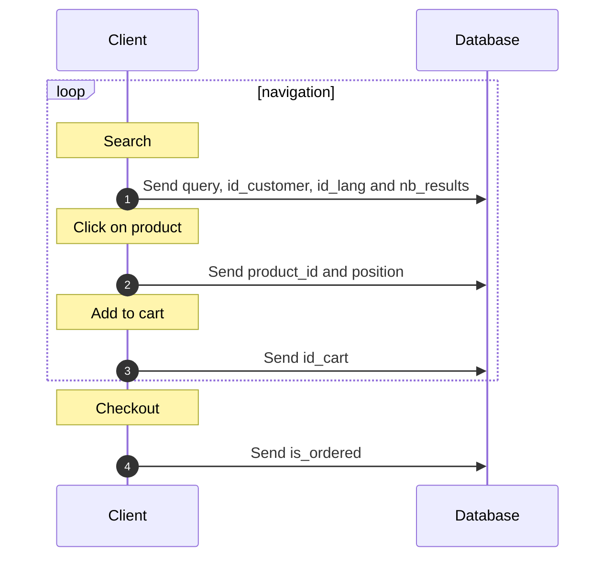

# Meilisearchprestashop

## Indexation CLI

La commande CLI permet d'indexer les produits dans Meilisearch depuis le terminal, sans passer par le cron HTTP.

```bash
# Indexer toutes les langues
php bin/console meilisearch:index-products

# Indexer une seule langue
php bin/console meilisearch:index-products --lang=fr

# Personnaliser la taille des batchs (défaut : 200)
php bin/console meilisearch:index-products --batch-size=500
```

### Exemple de cron

```bash
# Tous les jours à 3h du matin
0 3 * * * cd /var/www/prestashop && php bin/console meilisearch:index-products >> /var/log/meilisearch_index.log 2>&1
```

## Statistics

